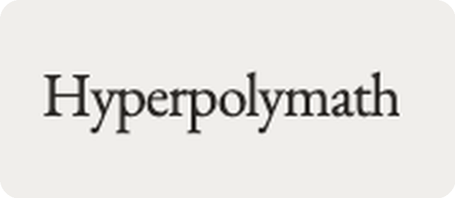

<div align="center">



<br/>
<br/>

> *"You don't have to choose between being a runner or a musician,*
> *a creator or a scholar. The Renaissance had it right."*

<br/>

[](./LICENSE)
[](https://nextjs.org)
[](https://react.dev)
[](https://www.typescriptlang.org)
[](https://tailwindcss.com)
[](https://supabase.com)
[](https://orm.drizzle.team)
[](https://anthropic.com)

</div>

---

## Abstract

**Hyperpolymath** is a personal life-OS for people who refuse to specialize. Areas, projects, classes, tasks, quick captures, and Google Calendar, all unified under a single natural-language agent called **JARVIS**, built on Claude Sonnet 4.6.

Type one sentence. The right action lands in the right place. Every time.

```
  ┌──────────────────────────────────────────────────────────────────────┐
  │  $  dinner with anna 8pm saturday. buy her flowers friday afternoon  │
  │                                                                      │
  │  ⚜  scheduled  →  gcal · sat 8:00pm · "Dinner with Anna"            │
  │  ⚜  created    →  task · fri afternoon · P2 · "Buy flowers"         │
  └──────────────────────────────────────────────────────────────────────┘
```

This is **v2**. A ground-up rebuild of [`polymath-web`](https://github.com/filippo-fonseca/polymath-web) with a tighter MVP, a Postgres-backed stack, and a stronger agent contract. The aesthetic is *academic paper crossed with Notion crossed with Todoist*: crisp, journal-vibe, EB Garamond / Louize, unapologetically Renaissance.

---

## ⚜  Why Hyperpolymath

Modern productivity tools assume you're one thing. A runner, or a researcher, or a founder. Habits live in one app, training in another, nutrition somewhere else, ideas scattered across three different notebooks. Context-switching kills momentum, and the more domains you operate across, the more friction compounds.

Hyperpolymath rejects the premise. **One system. One inbox. One sentence.** Running discipline informs studying discipline. Music trains pattern recognition. Everything connects, so the tool should too.

---

## ⚜  The Engine: JARVIS

JARVIS is the centerpiece. A streaming, structured-output agent built on Claude Sonnet 4.6 with **Strict Tool Use** for zero-parse-error JSON contracts. One input becomes N actions, each a different shape.

| Input | JARVIS infers |
|---|---|
| `finish anth pset $ANTH 2480 p2` | Task · *Finish anth pset* · P2 · linked to project ANTH 2480 |
| `loved anna's mom. such a lovely family` | Capture · no tag · personal reflection |
| `#idea polymathy as a competitive advantage` | Capture · tagged `#idea` |
| `dinner with anna 8pm sat` | gcal event · Saturday 20:00 |
| `gym tomorrow 7am, then bio pset $BIOL 1010 by 3pm` | gcal event · 07:00 + Task · due 15:00 linked to BIOL 1010 |

**Design principles**

- **Capture-first.** Ambiguous input becomes a capture. JARVIS never asks a clarifying question for non-destructive actions.
- **Inline references.** `$projectname` resolves to project IDs, `#hashtag` to tags. Highlighted in the input bar, normalized before reaching the model.
- **Native date/time.** "tomorrow", "next thursday", "8pm sat", "M/D", time ranges. All parsed.
- **Personality.** British register, formal, concise, dry, never sycophantic. Voice, wake-word ("Hey Jarvis"), and clap-detection ship in Phase 7.

---

## ⚜  Architecture

```
                                  ┌──────────────────────────────┐
                                  │   JARVIS  ·  Claude 4.6      │
                                  │   strict tool use · stream   │
                                  └──────────────┬───────────────┘
                                                 │ structured JSON
                                                 ▼
   ┌──────────────────────┐         ┌─────────────────────────────┐         ┌─────────────────────┐
   │   Next.js 16 (RSC)   │ ──────► │   Server Actions / API      │ ──────► │  Drizzle  ·  pg     │
   │   Tailwind 4 · React │ ◄────── │   Zod validation · executor │ ◄────── │  Supabase Postgres  │
   │   shadcn · Motion 12 │         └──────────────┬──────────────┘         └──────────┬──────────┘
   └──────────┬───────────┘                        │                                    │
              │                                    │ Realtime ch                        │ RLS · userId
              │ TanStack Query                     ▼                                    │
              │ invalidate on event ◄──── Supabase Realtime ────────────────────────────┘
              │
              └──────────────────────────────────────► Google Calendar  (source of truth · gcal CRUD)
```

**The load-bearing decisions**

| Decision | Reason |
|---|---|
| **Direct `@anthropic-ai/sdk`** (not Vercel AI SDK) | Single-provider + heavy tool use + custom streaming UX. Less indirection, more control. |
| **Drizzle for queries · `supabase-js` for everything else** | Drizzle = typed schema as source of truth. `supabase-js` handles what it's actually good at (Auth, Realtime, Storage). |
| **`getClaims()` over `getSession()`** | JWT-validated against published public keys. `getSession()` reads cookies without revalidation, which is spoofable. |
| **TanStack Query + Realtime invalidation** | Realtime fires → invalidate query → refetch. Simpler than merging payloads into cache. Free dedup, optimism, devtools. |
| **gcal events are NOT in Postgres** | Google Calendar is the source of truth for scheduling. The app is a CRUD operator over gcal. |
| **`userId` scoping from day one + RLS** | Single-user architecturally, multi-user-ready by construction. |

---

## ⚜  Stack

```
┌─ runtime ───────────────────────────────┐    ┌─ agent ─────────────────────────────────┐
│   Next.js 16 · React 19.2 · Turbopack   │    │   @anthropic-ai/sdk 0.96                │
│   TypeScript 5.6+ (strict)              │    │   claude-sonnet-4-6                     │
│   Tailwind 4.1 (Oxide, CSS-first)       │    │   strict tool use · prompt caching      │
└─────────────────────────────────────────┘    └─────────────────────────────────────────┘

┌─ data ──────────────────────────────────┐    ┌─ ui ────────────────────────────────────┐
│   Supabase (Postgres / Auth / Realtime) │    │   shadcn/ui · Radix Primitives          │
│   Drizzle ORM 0.36 · postgres 3.x       │    │   Motion 12 (motion/react)              │
│   @supabase/ssr 0.10 (cookie auth)      │    │   Lucide · cmdk · sonner · @dnd-kit     │
│   googleapis (Calendar v3)              │    │   EB Garamond · Louize · journal vibe   │
└─────────────────────────────────────────┘    └─────────────────────────────────────────┘

┌─ state ─────────────────────────────────┐    ┌─ quality ───────────────────────────────┐
│   TanStack Query 5                      │    │   Vitest 3 · @testing-library/react     │
│   Supabase Realtime (invalidation only) │    │   Biome 1.9 (lint + format)             │
│   nuqs (URL state) · zod 4 (validation) │    │   Drizzle Kit (migrations · studio)     │
└─────────────────────────────────────────┘    └─────────────────────────────────────────┘
```

---

## ⚜  Surfaces

```
   /                       JARVIS console, the homescreen
   /today                  today's tasks + today's gcal
   /tasks                  all tasks (kanban · list · filters)
   /captures               quick-capture feed (hashtag-filterable, searchable)
   /projects               area tree → project pages (Notion-style breadcrumb)
   /calendar               gcal operator · full CRUD, never persisted locally
   /settings               profile · graduation year · gcal connection · defaults
```

---

## ⚜  Project Layout

```
hyperpolymath-v2/
├── apps/
│   └── web/                   Next.js 16 app: UI, API routes, server actions
│       ├── app/               App Router (RSC + server actions)
│       ├── components/        shadcn primitives + feature components
│       ├── drizzle/           SQL migrations (numbered, generated)
│       ├── lib/               db · auth · gcal · jarvis · realtime · utils
│       └── tests/             Vitest specs (agent contract, parsers, executors)
├── packages/
│   └── jarvis-core/           agent logic, sharable with a future CLI
├── .planning/                 GSD workflow artifacts (roadmap, phases, state)
└── resources/                 vision docs (core.md, handoff, idea archive)
```

---

## ⚜  Quickstart

> Requires Node 20.9+, pnpm 9.12+, a Supabase project, and an Anthropic API key.

```bash
# clone + install
git clone https://github.com/filippo-fonseca/hyperpolymath-v2.git
cd hyperpolymath-v2
pnpm install

# env
cp .env.example .env.local        # fill: ANTHROPIC_API_KEY, SUPABASE_*, GOOGLE_*

# database
pnpm db:migrate                   # apply Drizzle migrations to Supabase

# run
pnpm dev                          # → http://localhost:3000
```

**Useful scripts**

```
pnpm dev            next dev --turbopack
pnpm build          production build
pnpm typecheck      tsc --noEmit (strict)
pnpm test           vitest run
pnpm lint           biome check .
pnpm db:generate    diff schema → new migration
pnpm db:migrate     apply pending migrations
```

---

## ⚜  Roadmap

```
  ✓  phase 0 ─ scaffolding · auth · tooling
  ✓  phase 1 ─ areas / projects / tasks / captures · manual CRUD
  ✓  phase 2 ─ project pages · tree sidebar · realtime
  ✓  phase 3 ─ today · captures feed · search
  ✓  phase 4 ─ Google Calendar bi-directional sync
  ▶  phase 5 ─ JARVIS console · streaming · strict tool use   ← we are here
  ◯  phase 6 ─ polish · motion · empty states · onboarding
  ◯  phase 7 ─ JARVIS voice + wake-word ("Hey Jarvis")
  ◯  phase 8 ─ public beta
```

Detailed phase plans live in [`.planning/`](./.planning).

---

## ⚜  Philosophy

> **2.1**  Unified, not fragmented. *One system for everything.*
>
> **2.2**  Daily execution compounds. *Small consistent actions across all domains.*
>
> **2.3**  Skills are networks. *Running builds discipline for studying.*
>
> **2.4**  Capture everything. *Ideas are fleeting; the inbox is frictionless.*
>
> **2.5**  Measure what matters. *What gets measured gets mastered. But only measure what moves the needle.*

---

## ⚜  License & Brand

MIT. See [`LICENSE`](./LICENSE). Open source by commitment, not convenience. Secrets live in env, never in the repo.

Hyperpolymath is built and maintained by [@filippo-fonseca](https://github.com/filippo-fonseca). The name, the wordmark, and the Renaissance trade-dress are part of an evolving personal brand; please don't reuse them for derivative products without asking.

<div align="center">

```
       ⚜    ⚜    ⚜    ⚜    ⚜    ⚜    ⚜    ⚜    ⚜    ⚜
```

*be goated. well.*

</div>
