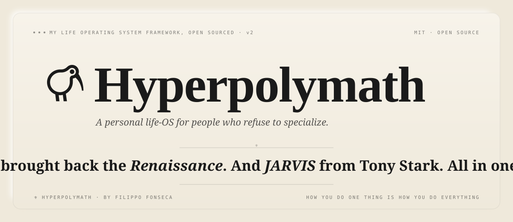

<div align="center">



<br/>

> *"You don't have to choose between being a runner or a musician,*
> *a creator or a scholar. The Renaissance had it right."*

<br/>

[](./LICENSE)
[](#-status)
[](https://nextjs.org)
[](https://react.dev)
[](https://www.typescriptlang.org)
[](https://tailwindcss.com)
[](https://supabase.com)
[](https://orm.drizzle.team)
[](https://anthropic.com)
[](https://tauri.app)

</div>

---

## Abstract

**Hyperpolymath** is a personal life-OS for people who refuse to specialize. Areas, projects, classes, tasks, habits, captures, training, and Google Calendar — all unified under a single natural-language agent called **JARVIS**, built on Claude Sonnet 4.6. The whole thing is tied together by a **LifeOS** homepage organized around the areas tree.

It runs on three surfaces: the **web app**, a **desktop app** (Tauri-based, keyboard-shortcut driven, mic-gated so it never listens by accident), and an optional **physical extender** — a small macropad with an onboard wake-word module that flips JARVIS into voice mode only when the device is awake.

Type one sentence. The right action lands in the right place. Every time.

```
  ┌──────────────────────────────────────────────────────────────────────┐
  │  $  coffee w/ sam 3pm friday. submit chem pset by 5pm thursday p1    │
  │                                                                      │
  │  ⚜  scheduled  →  gcal · fri 3:00pm · "Coffee with Sam"             │
  │  ⚜  created    →  task · thu 5:00pm · P1 · "Submit chem pset"       │
  └──────────────────────────────────────────────────────────────────────┘
```

This is **v2**. A ground-up rebuild of [`polymath-web`](https://github.com/filippo-fonseca/polymath-web) with a tighter MVP, a Postgres-backed stack, and a stronger agent contract. The aesthetic is *academic paper crossed with Notion crossed with Todoist*: crisp, journal-vibe, EB Garamond / Louize, unapologetically Renaissance.

---

## ⚜  Why Hyperpolymath

Modern productivity tools assume you're one thing. A runner, or a researcher, or a founder. Habits live in one app, training in another, nutrition somewhere else, ideas scattered across three different notebooks. Context-switching kills momentum, and the more domains you operate across, the more friction compounds.

Hyperpolymath rejects the premise. **One system. One inbox. One sentence.** Running discipline informs studying discipline. Music trains pattern recognition. Everything connects, so the tool should too.

---

## ⚜  Features

Everything below is **shipped and working** unless explicitly marked otherwise.

#### Agent
- **JARVIS console.** Streaming Claude Sonnet 4.6 with Strict Tool Use — zero parse errors, multi-tool calls per turn.
- **Agentic loop.** Multi-step plans: read context → act → react → continue. Full **create / read / update / delete** over tasks, captures, projects, areas, gcal events.
- **Inline references.** `$projectname` resolves to a project ID, `#hashtag` to a tag, highlighted as chips in the composer and normalized before reaching the model.
- **Native time language.** "tomorrow", "next thursday", "8pm sat", time ranges, M/D — all parsed.
- **Voice mode.** "Hey JARVIS" wake-word + ambient follow-up window. ElevenLabs streaming TTS. Per-turn interrupt + stop control.
- **Personality.** British register, formal, concise, dry, never sycophantic.

#### Surfaces
- **LifeOS** — the homepage. Areas tree, Notion-style banner, and today's widgets (incoming tasks, gcal, recent captures, habit streaks, training, live signals).
- **JARVIS** — full console with streaming, history, split-screen mode (run any other route alongside the agent), and per-turn interrupt.
- **Today** — the morning dashboard. Tasks due today, today's calendar, captures from the last 24h, habits for the day.
- **Areas** — your life domains. Top of the hierarchy. Each area gets its own page, its own banner, its own children.
- **Projects** — bounded efforts inside areas. Classes are first-class. Notion-style breadcrumb. Tasks + captures nested inside.
- **Tasks** — kanban + list views, filters, P1–P4 priorities, due-date inference, project + area scoping.
- **Captures** — frictionless inbox: text + hashtag-filterable, full-text search, promote to task in one click.
- **Calendar** — bi-directional Google Calendar operator. gcal is the source of truth; nothing is persisted locally.
- **Habits** — daily-habit primitive with streaks, weekly grid, completion history.
- **Training** — fitness / activity planner scoped to the Training area; workouts, sessions, intensity signal.
- **Health** — body-stat tracking surface (weight, sleep, etc.) — early surface, expanding.
- **Graph** — visual map of areas, projects, captures, and tasks and how everything connects. Force-directed; hover to inspect.
- **Insights** — counters, completion rates, time-budget signal across areas + projects.
- **Settings** — profile, graduation year, gcal connection, voice + agent defaults, device pairing.

#### Platform
- **Desktop app** (Tauri / Rust) — global keyboard shortcut to summon JARVIS, mic gated behind an explicit toggle, no always-on listening.
- **Desktop ↔ web mic bridge** — when the desktop is holding the mic, the web JARVIS console knows and stops competing. A "Voice via desktop" indicator surfaces in the nav.
- **Realtime everywhere** — Supabase Realtime channels invalidate TanStack Query caches; every surface reflects every change instantly.
- **Google OAuth.** Single sign-on via Supabase Auth.
- **Auth-aware everything.** All rows scoped to `userId` from day one; RLS enforced at the row level.
- **MIT, public, secrets in env only.**

---

## ⚜  The Engine: JARVIS

JARVIS is the centerpiece. A streaming, structured-output agent built on Claude Sonnet 4.6 with **Strict Tool Use** for zero-parse-error JSON contracts. One input becomes N actions, each a different shape.

| Input | JARVIS infers |
|---|---|
| `finish anth pset $ANTH 2480 p2` | Task · *Finish anth pset* · P2 · linked to project ANTH 2480 |
| `great energy in the lab group today. so much momentum` | Capture · no tag · personal reflection |
| `#idea polymathy as a competitive advantage` | Capture · tagged `#idea` |
| `coffee with sam 3pm fri` | gcal event · Friday 15:00 |
| `gym tomorrow 7am, then bio pset $BIOL 1010 by 3pm` | gcal event · 07:00 + Task · due 15:00 linked to BIOL 1010 |
| `move the chem deadline to next monday and bump priority` | Update task · due-date + priority in one tool call |
| `delete the placeholder capture I just made` | Delete capture · resolved by recency reference |

**Design principles**

- **Capture-first.** Ambiguous input becomes a capture. JARVIS never asks a clarifying question for non-destructive actions.
- **Agentic.** Read-then-write per turn: JARVIS can fetch state, decide, and act in the same exchange (Phase 5.1).
- **Voice as a posture, not a default.** On desktop, voice is opt-in via a toggle (or the physical extender). No ambient mic ever runs without consent.
- **Anthropic discipline.** Prompt caching on stable context, state priming, latency budgets — see Phases 9–11.

---

## ⚜  Architecture

```
                                  ┌──────────────────────────────┐
                                  │   JARVIS  ·  Claude 4.6      │
                                  │   strict tool use · stream   │
                                  └──────────────┬───────────────┘
                                                 │ structured JSON
                                                 ▼
   ┌──────────────────────┐         ┌─────────────────────────────┐         ┌─────────────────────┐
   │   Next.js 16 (RSC)   │ ──────► │   Server Actions / API      │ ──────► │  Drizzle  ·  pg     │
   │   Tailwind 4 · React │ ◄────── │   Zod validation · executor │ ◄────── │  Supabase Postgres  │
   │   shadcn · Motion 12 │         └──────────────┬──────────────┘         └──────────┬──────────┘
   └──────────┬───────────┘                        │                                    │
              │                                    │ Realtime ch                        │ RLS · userId
              │ TanStack Query                     ▼                                    │
              │ invalidate on event ◄──── Supabase Realtime ────────────────────────────┘
              │
              └──────────────────────────────────────► Google Calendar  (source of truth · gcal CRUD)
```

**The load-bearing decisions**

| Decision | Reason |
|---|---|
| **Direct `@anthropic-ai/sdk`** (not Vercel AI SDK) | Single-provider + heavy tool use + custom streaming UX. Less indirection, more control. |
| **Drizzle for queries · `supabase-js` for everything else** | Drizzle = typed schema as source of truth. `supabase-js` handles what it's actually good at (Auth, Realtime, Storage). |
| **`getClaims()` over `getSession()`** | JWT-validated against published public keys. `getSession()` reads cookies without revalidation, which is spoofable. |
| **TanStack Query + Realtime invalidation** | Realtime fires → invalidate query → refetch. Simpler than merging payloads into cache. Free dedup, optimism, devtools. |
| **gcal events are NOT in Postgres** | Google Calendar is the source of truth for scheduling. The app is a CRUD operator over gcal. |
| **`userId` scoping from day one + RLS** | Single-user architecturally, multi-user-ready by construction. |
| **Desktop app holds the mic** | One process owns the mic globally; the web app defers. Eliminates the "two tabs both listening" failure mode. |

---

## ⚜  Stack

```
┌─ runtime ───────────────────────────────┐    ┌─ agent ─────────────────────────────────┐
│   Next.js 16 · React 19.2 · Turbopack   │    │   @anthropic-ai/sdk 0.96                │
│   TypeScript 5.6+ (strict)              │    │   claude-sonnet-4-6                     │
│   Tailwind 4.1 (Oxide, CSS-first)       │    │   strict tool use · prompt caching      │
└─────────────────────────────────────────┘    └─────────────────────────────────────────┘

┌─ data ──────────────────────────────────┐    ┌─ ui ────────────────────────────────────┐
│   Supabase (Postgres / Auth / Realtime) │    │   shadcn/ui · Radix Primitives          │
│   Drizzle ORM 0.36 · postgres 3.x       │    │   Motion 12 (motion/react)              │
│   @supabase/ssr 0.10 (cookie auth)      │    │   Lucide · cmdk · sonner · @dnd-kit     │
│   googleapis (Calendar v3)              │    │   EB Garamond · Louize · journal vibe   │
└─────────────────────────────────────────┘    └─────────────────────────────────────────┘

┌─ state ─────────────────────────────────┐    ┌─ desktop ───────────────────────────────┐
│   TanStack Query 5                      │    │   Tauri 2 · Rust                        │
│   Supabase Realtime (invalidation only) │    │   global shortcut · macOS entitlements  │
│   nuqs (URL state) · zod 4 (validation) │    │   device-bearer token for prod TTS      │
└─────────────────────────────────────────┘    └─────────────────────────────────────────┘

┌─ voice ─────────────────────────────────┐    ┌─ quality ───────────────────────────────┐
│   ElevenLabs streaming TTS              │    │   Vitest 3 · @testing-library/react     │
│   Browser MediaRecorder + VAD           │    │   Biome 1.9 (lint + format)             │
│   "Hey JARVIS" wake-word + ambient win  │    │   Drizzle Kit (migrations · studio)     │
└─────────────────────────────────────────┘    └─────────────────────────────────────────┘
```

---

## ⚜  Where You Use It

Three surfaces, one backend. The desktop app is the real daily driver; the web app is for anywhere you're not at your machine; the physical extender is a fun side-project for voice-without-always-on-mic.

```
        ┌───────────────────────────┐
        │   jarvis · physical       │   optional macropad i'm building
        │   ────────────────────    │   • on-device wake-word module
        │   ◉  ◉  ◉  ◉  ◉  ◉        │   • only listens when device is awake
        │   ◉  ◉  ◉  ◉  ◉  ◉        │   • no extender on  →  no wake word, no mic
        └─────────────┬─────────────┘
                      │  BLE / USB (when awake)
                      ▼
   ┌────────────────────────────────┐        ┌──────────────────────────┐
   │   Desktop App   (Tauri · Rust) │        │   Web App   (Next.js 16) │
   │   ────────────────────────────  │        │   ──────────────────────  │
   │   ⌘K · keyboard-first hub       │        │   browser anywhere       │
   │   mic gated · opt-in only       │        │   same auth, same data   │
   │   primary interaction surface   │        │   for laptops, phones    │
   └─────────────────┬──────────────┘        └────────────┬─────────────┘
                     │                                     │
                     └─────────────────┬───────────────────┘
                                       ▼
                          ┌──────────────────────────┐
                          │  hyperpolymath backend   │
                          │  Supabase · Drizzle · gc │
                          └──────────────────────────┘
```

**Why the desktop app is the hub.** No browser tab to hunt for, system-level shortcut to summon JARVIS, mic is opt-in via an explicit toggle (or the physical extender). When the desktop holds the mic, the web JARVIS console shows a quiet "Voice via desktop" pill in the nav so you always know which surface is listening.

---

## ⚜  Project Layout

```
hyperpolymath-v2/
├── apps/
│   ├── web/                   Next.js 16 app: UI, API routes, server actions
│   │   ├── app/               App Router (RSC + server actions)
│   │   ├── components/        shadcn primitives + feature components
│   │   ├── drizzle/           SQL migrations (numbered, generated)
│   │   ├── lib/               db · auth · gcal · jarvis · realtime · utils
│   │   └── tests/             Vitest specs (agent contract, parsers, executors)
│   └── desktop/               Tauri shell · keyboard-first JARVIS hub
│       └── src-tauri/         Rust side (global shortcut, window mgmt, IPC)
├── packages/
│   └── jarvis-core/           agent logic, shared by web + desktop + CLI
├── tools/
│   ├── hyperpolymath/         dev orchestrator (spawns web + desktop + bridge)
│   └── jarvis-physical/       physical extender (macropad)
│       └── bridge/            host-side bridge: BLE/USB → desktop app
├── supabase/                  local Supabase config + edge functions
├── .planning/                 GSD workflow artifacts (roadmap, phases, state)
└── resources/                 vision docs (core.md, handoff, idea archive)
```

---

## ⚜  Quickstart

> Requires Node 20.9+, pnpm 9.12+, a Supabase project, and an Anthropic API key. ElevenLabs key optional (voice mode). Google OAuth credentials required for the Calendar integration.

```bash
# clone + install
git clone https://github.com/filippo-fonseca/hyperpolymath-v2.git
cd hyperpolymath-v2
pnpm install

# env
cp .env.example .env.local        # fill: ANTHROPIC_API_KEY, SUPABASE_*, GOOGLE_*, ELEVENLABS_API_KEY

# database
pnpm db:migrate                   # apply Drizzle migrations to Supabase

# run (web only)
pnpm dev                          # → http://localhost:3000

# run (full stack: web + desktop + bridge)
node tools/hyperpolymath/hyperpolymath.mjs
```

**Useful scripts**

```
pnpm dev            next dev --turbopack
pnpm build          production build
pnpm typecheck      tsc --noEmit (strict)
pnpm test           vitest run
pnpm lint           biome check .
pnpm db:generate    diff schema → new migration
pnpm db:migrate     apply pending migrations
```

See [`DEPLOYMENT.md`](./DEPLOYMENT.md) for Vercel + Supabase prod setup, and [`CONTRIBUTING.md`](./CONTRIBUTING.md) for the GSD workflow used to plan every phase.

---

## ⚜  Roadmap

**Shipped**

```
  ✓  phase 0    ─ scaffolding · auth · tooling
  ✓  phase 1    ─ areas / projects / tasks / captures · manual CRUD
  ✓  phase 2    ─ project pages · tree sidebar · realtime
  ✓  phase 3    ─ today · captures feed · search
  ✓  phase 4    ─ Google Calendar bi-directional sync
  ✓  phase 5    ─ JARVIS console · streaming · strict tool use
  ✓  phase 5.1  ─ JARVIS agentic refactor · multi-step CRUD
  ✓  phase 6    ─ polish · motion · empty states · onboarding
  ✓  phase 6.1  ─ visual redesign · JARVIS × Notion
  ✓  phase 6.2  ─ Anthropic-discipline rebuild
  ✓  phase 7    ─ JARVIS voice + wake-word ("Hey JARVIS") · ambient mode
  ✓  phase 8    ─ public landing + manifesto
  ✓  phase 9    ─ latency telemetry baseline
  ✓  phase 10   ─ TTS route boundary + latency wins
  ✓  phase 11   ─ prompt cache + state priming
  ✓  phase 12   ─ on-device wake-word + mic gating
  ✓  phase 14   ─ JARVIS desktop mic middleman (desktop ↔ web bridge)
  ✓  phase 15   ─ training / fitness / activity planner
```

**Next**

```
  ◯  habits primitive polish + areas tree v2
  ◯  LifeOS homepage v2 · widget composition
  ◯  jarvis-physical extender · onboard wake-word
  ◯  public beta hardening
```

Detailed phase plans live in [`.planning/`](./.planning). Backlog and parked ideas (markdown writing surface, hibernation mode, interrupt control, JARVIS Gmail, mobile app, personal context graph) live under [`.planning/phases/999.*`](./.planning/phases/).

---

## ⚜  Status

**Public preview.** Hyperpolymath is built and used daily by one person (me). The code is public and MIT-licensed because that's a brand commitment, not because the product is positioned as a multi-tenant SaaS. The schema is `userId`-scoped from day one with RLS, so multi-user is structurally possible — but onboarding for additional users is intentionally not the focus.

If you want to self-host the whole stack for your own use, the quickstart above is the path. If you find something broken or want to discuss an idea, open an issue or a PR.

---

## ⚜  Philosophy

> **2.1**  Unified, not fragmented. *One system for everything.*
>
> **2.2**  Daily execution compounds. *Small consistent actions across all domains.*
>
> **2.3**  Skills are networks. *Running builds discipline for studying.*
>
> **2.4**  Capture everything. *Ideas are fleeting; the inbox is frictionless.*
>
> **2.5**  Measure what matters. *What gets measured gets mastered. But only measure what moves the needle.*

---

## ⚜  Security

Found something? See [`SECURITY.md`](./SECURITY.md) for the responsible-disclosure path. The TL;DR: please don't open public issues for vulnerabilities — email first.

---

## ⚜  License & Brand

MIT. See [`LICENSE`](./LICENSE). Open source by commitment, not convenience. Secrets live in env, never in the repo.

Hyperpolymath is built and maintained by [@filippo-fonseca](https://github.com/filippo-fonseca). The name, the wordmark, and the Renaissance trade-dress are part of an evolving personal brand; please don't reuse them for derivative products without asking.

<div align="center">

```
       ⚜    ⚜    ⚜    ⚜    ⚜    ⚜    ⚜    ⚜    ⚜    ⚜
```

*be goated. well.*

</div>
